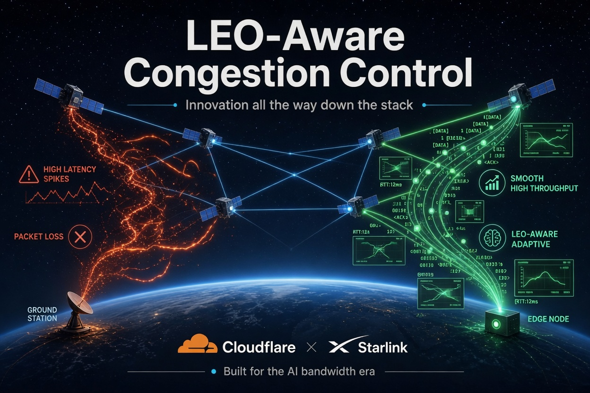

# LeoAware Transport (OrbitStack)

**LEO-aware congestion control research prototype** for Starlink-class satellite paths.

**Product brief:** [orbitstack.jonbailey.xyz](https://orbitstack.jonbailey.xyz/)  
**Org:** [Pitchfork-and-Torch](https://github.com/Pitchfork-and-Torch) | **License:** MIT

Traditional congestion control assumes a **stable path and stable RTT**. LEO (Starlink-class) has neither. Bandwidth alone is insufficient; the transport stack needs LEO-aware innovation.

This repo is a **self-contained, runnable research prototype** (pure Python + numpy/matplotlib/pandas). Clone, run the suite, inspect numbers and plots. Sender modules are shaped so they can be adapted toward a QUIC congestion controller (e.g. quiche-class stacks).

**Not affiliated with X, Cloudflare, or SpaceX.** Educational BBR approx - not bit-exact production BBRv3.



*ASCENT-aware LEO control plane motif (OrbitStack product art).*

---

## Problem

LEO dynamics break core CCA assumptions (CUBIC, BBR family, etc.):

| Phenomenon | Effect on classic CCAs |
|------------|------------------------|
| Handovers / reconfigs every ~15-60s | Stale min-RTT and bandwidth samples |
| Abrupt RTT jumps (20-100+ ms base) | Wrong BDP; under- or over-send |
| Non-congestive loss bursts (beam/ISL) | CUBIC collapses; BBR may keep stale model |
| Capacity flicker | Under-utilization or excess queueing |

**Goal:** high goodput + controlled latency under LEO dynamics, with a **sender-side, QUIC-friendly** design (no hard dependency on in-network assist).

---

## Quick start

```bash
cd leo-aware-transport
pip install -r requirements.txt
python -m experiments.run_suite
python -m experiments.multi_seed
python -m experiments.run_trace_suite
```

Outputs land in `results/`:

- `summary.csv` / `summary.json` - metrics table
- `*_timeseries.png` - cwnd, goodput, RTT with handover markers
- `leo_single_throughput_latency.png` - Pareto scatter

Optional single-scenario demo:

```bash
python -m experiments.demo
```

---

## Architecture

```
leo_cc/
  network.py          # Starlink-class path dynamics (handover, RTT, capacity, loss)
  ccas.py             # CUBIC, BBRv3approx, LeoAware (extractable sender modules)
  sim.py              # Slot-based multi-flow transport simulator
  ascent_d.py         # ASCENT-D P9: RS(255,223) + erase-on-fail
  ascent_path_hint.py # PATHHINT units + fail-closed ingest
  orb_signals.py      # OrbCC-style synthetic telemetry (optional)
  harness.py          # product vs research era constants (starlink_v1 / ope_v36)
  metrics.py          # Goodput, RTT percentiles, loss, Jain fairness
  plotting.py         # Timeseries + throughput-latency figures
experiments/
  run_suite.py              # Full reproducible evaluation (endpoint default)
  run_ablation.py           # endpoint / ASCENT-D / Orb / hybrid matrix
  run_wetlinks.py           # wetlinks_v1 geometry + 5-window CCA
  slice_wetlinks.py         # re-fetch / cut WetLinks 90s windows
  slice_leocc.py            # LeoCC 4.8K.zip → 5 downlink 90s windows
  run_leocc.py              # leocc_v1 geometry + 5-window CCA
  test_ascent_d_integrity.py
  test_wetlinks_integrity.py
  test_leocc_integrity.py
  demo.py
docs/
  architecture.md
  harness_eras.md
  leoaware_v39_starlink_v1.md
  starlink_csv_ingest.md
  leoaware_v311_wetlinks.md
  leoaware_v313_leocc.md      # research-era ingest; not product lock
  ascent_d_orbcc_hybrid.md
  related_work.md
  cloudflare_starlink_bridge.md
  leoaware_v312_zhao_zenodo23.md  # research-era ingest; not product lock
```

### Network model

`LeoPath` is a configurable discrete-time path (default 10 ms slots):

- Periodic + jittered handovers / connection reconfigurations
- Abrupt RTT and capacity redraws per epoch
- Non-congestive loss window correlated with reconfiguration
- Shared bottleneck buffer (overflow = congestive loss)
- Optional simplified ISL extra delay (`isl_enabled=True`)
- `terrestrial=True` for stable-path control experiments

Conceptual entities: **ground terminal -> LEO satellite -> (ISL) -> ground station**. The path object abstracts end-to-end delay and bottleneck capacity as seen by the sender.

### Congestion control

| Algorithm | Role |
|-----------|------|
| **CUBIC** | Loss-based baseline; treats mobility loss as congestion |
| **BBRv3approx** | Model-based baseline (educational BBR-family; not bit-exact BBRv3) |
| **LeoAware** | Novel LEO-aware CCA (default: endpoint-only detection) |

All implement a small sender-side interface (`on_ack`, `on_loss`, `can_send`, optional `on_path_hint`) so they can be ported toward a QUIC congestion controller.

---

## LeoAware design

### Endpoint reconfiguration detection

No perfect network cooperation required. Signals:

1. **RTT jump outliers** vs recent median / p25 (absolute and relative thresholds)
2. **ACK inter-arrival gaps** (path freeze during reconfig)
3. **Loss bursts without RTT inflation** (non-congestive mobility)

Optional `use_path_hints=True` accepts explicit reconfiguration signals (Starlink / edge assist path).
Optional `use_orb_signals=True` consumes OrbCC-style pathID / queue telemetry when the simulator injects it.

**ASCENT-D integrity (v3.2):** critical path hints can ride ASCENT-D P9 (RS(255,223) + CRC). Erase-on-fail: never act on a corrupted control unit. See `docs/ascent_d_orbcc_hybrid.md` and `python -m experiments.test_ascent_d_integrity`.

```bash
python -m experiments.test_ascent_d_integrity
python -m experiments.run_ablation --fast --seeds 13,7
```

### Reconfiguration-aware bottleneck model

On detected change:

1. Discard stale **min-RTT** and **bandwidth samples**
2. Enter **REPROBE**: soft cwnd cut (~0.55x), not CUBIC collapse
3. Rapid controlled growth, then cruise near ~1.08 x BDP from post-change samples

### Mobility vs congestion

| Signal | Action |
|--------|--------|
| Loss near reconfig or loss without RTT inflation | **Do not** collapse cwnd (`mobility_loss`) |
| Loss + elevated RTT / buffer overflow | Congestive recovery (~0.7x) |

This is the core distinction classic CUBIC lacks on LEO.

### v3.9 Crest (product lock on `starlink_v1`)

On cruise/reclaim only (never during REPROBE; never gates `ep:loss_burst`):

1. **Crest Abort** — abort TBPR/OCE when RTT > ~1.35× recent median
2. **Dual-Ledger Cruise** — `cwnd_safe` vs `cwnd_tide` (tide ≤1.42× BDP, delay-clean)
3. **Local Surplus Guard** — stretch only if delivery EWMA ≥ ~0.85× prior_bw
4. **Freeze-only anticipator** — ACK-IA growth hold ~120 ms; never detect-suppress

---

## Evaluation suite

Scenarios in `experiments/run_suite.py`:

1. **leo_single** - long-lived flow, ~22s handovers
2. **leo_fast_ho** - aggressive ~12s handovers
3. **leo_multi** - 3 competing flows (Jain fairness)
4. **terrestrial** - stable path control

Metrics: goodput, avg / p95 / p99 RTT, loss rate, utilization, Jain index, handover count.

### Primary objective: multi-seed `leo_fast_ho`

Seeds 13,7,42,99,123 · 90s · **endpoint-only** default (public suite).  
Means only - do not market peaks.

**Harness eras — do not mix in one Current table** (`docs/harness_eras.md`):

| Era | Path | Dual-gate |
|-----|------|-----------|
| Research (v3.6–v3.7) | `ope_v36` | relative vs BBR on the same orbit |
| **Product (v3.9)** | **`starlink_v1`** | **absolute gp≥75 AND p95≤138.8** |
| Historical | coupled-RNG | v3.4/v3.5 numbers; different orbit per CCA |

`python -m experiments.multi_seed` defaults to **`starlink_v1`**. Research: `--path-profile ope_v36`.

#### Current: LeoAware v3.7 OCE on `ope_v36`

OPE-fair timeline (path identity identical across CCAs).

| CCA | Goodput mean | p95 mean | Notes |
|-----|-------------:|---------:|-------|
| CUBIC | 5.56 | 130.4 | Collapses under mobility |
| BBRv3approx | 58.21 | 152.9 | OPE+soft-QIR reference |
| **LeoAware v3.7 OCE** | **58.78** | **152.1** | **widened dual-gate vs BBR** |
| LeoAware v3.6 Keel | 58.27 | 152.1 | first OPE-fair dual-gate pass |
| LeoAware v3.5 Tide | 76.27 | 147.39 | coupled-RNG era (historical) |

v3.7 dual gate is **relative to BBR on the OPE-fair path** (research-only). Coupled-era absolute bars (gp≥75 / p95≤138.8) mixed different orbits per CCA and are not comparable.

**v3.8 Step 0:** on `ope_v36` those absolute bars are **geometrically impossible** (oracle gp mean 60.48; path-base p95 mean 142.32). LeoAware is already ~97% of oracle. See `docs/leoaware_v38_step0_feasibility.md`. Do not market +0.5 vs BBR as a paid Optimizer breakthrough.

#### v3.9 WIP scorecard on `starlink_v1` (not Current)

OPE-fair, same path for CUBIC + BBRv3approx + LeoAware. Soft-QIR α=0.20. Means, not peaks. **Not a Current bump. No paid landing copy.**

| CCA | Goodput mean | p95 mean | Notes |
|-----|-------------:|---------:|-------|
| CUBIC | 8.57 | 71.63 | Collapses under mobility |
| BBRv3approx | 82.44 | 76.66 | same orbit as LeoAware |
| **LeoAware v3.9 Crest** | **82.07** | **76.26** | absolute dual-gate on synthetic path |

Gates (this PR, pending Jon): gp **82.07 ≥ 75**, p95 **76.26 ≤ 138.8**, terr **78.62 ≥ 77** (p95 46 ms = path 40 + QIR). Geometry oracle 84.03 / path p95 70.79. Do not mix with `ope_v36` ~58/152.

Crest ablation (same path, `leo_fast_ho`): v37-style LeoAware already dual-gates (82.28 / 76.66). Crest flags are optional here; the era switch is load-bearing. See `docs/leoaware_v39_starlink_v1.md`.

Design: `docs/leoaware_v39_starlink_v1.md`. Archive: `results/archive/20260812-v39-starlink-v1/`. Measured CSV era: `docs/starlink_csv_ingest.md`.

### Hybrid fuse ablation (fast, seeds 13+7; not the v3.9 product lock)

| Variant | leo_fast_ho gp | p95 | Note |
|---------|---------------:|----:|------|
| endpoint | 84.04 | 123.9 | no assist |
| **hybrid** | **75.57** | **109.6** | ASCENT-D + Orb fuse; no double-cut |
| orb | 72.99 | 116.9 | pathID only |
| ascent_d_noisy | = endpoint | = endpoint | erase-on-fail proven |

Integrity: `python -m experiments.test_ascent_d_integrity` (green).

### Suite seed 13 snapshot (ope_v36 research; not the product lock)

| Scenario | CCA | Goodput Mbps | p95 RTT ms |
|----------|-----|-------------:|-----------:|
| leo_fast_ho | LeoAware | 63.36 | 146.9 |
| leo_single | LeoAware | 71.88 | 111.9 |
| terrestrial | LeoAware | 77.86 | 40.0 |

v3.7 OCE Current: Orbit Capacity Echo + SER-lite on `ope_v36`.  
v3.9 Crest is **WIP / not Current** until Jon merges: `docs/leoaware_v39_starlink_v1.md`.  
v3.3-A rails retained: hybrid fuse, ASCENT-D erase-on-fail.  
Log: `docs/experiment_log.md`. Design: `docs/leoaware_v37_oce.md`.  
Archive: `results/archive/20260812-v37-oce/`.  
v3.8 Step 0: `docs/leoaware_v38_step0_feasibility.md`.  
Eras: `docs/harness_eras.md`. Measured CSV: `docs/starlink_csv_ingest.md`.

Reproduce:

```bash
python -m experiments.test_ascent_d_integrity
python -m experiments.ope_feasibility --profiles starlink_v1 --seeds 13,7,42,99,123
python -m experiments.run_suite
python -m experiments.multi_seed --path-profile starlink_v1 --seeds 13,7,42,99,123 --tag 20260812-v39-starlink-v1
python -m experiments.crest_ablation --tag 20260812-v39-crest-ablation
python3 -m experiments.multi_seed --path-profile ope_v36
python3 -m experiments.run_wetlinks --tag 20260813-v311-wetlinks
python3 -m experiments.test_wetlinks_integrity
python -m experiments.run_ablation --fast --seeds 13,7
# inspect results/summary.csv and plots
```

---

## Collaboration bridge (Cloudflare x Starlink)

See `docs/cloudflare_starlink_bridge.md` for a fuller write-up. Short version:

1. **Endpoint-only first** - ship LeoAware-class logic in quiche / edge QUIC without waiting on satellite signaling.
2. **Optional path hints** - if Starlink exposes reconfig / ephemeris / beam-switch markers, feed `on_path_hint` for lower detection lag.
3. **Edge deployment** - Cloudflare PoPs terminating Starlink eyeball traffic are a natural A/B measurement surface.
4. **Multipath / ISL** - later: schedule across dual paths when multiple ground stations or ISL routes are visible.
5. **AI-scale traffic** - long-lived bulk + interactive flows both suffer from wrong BDP after hops; LEO-aware CC is infrastructure for reliable model training and inference over satellite.

---

## Limitations and next steps

- Packet-level fidelity is simplified (slot sim, not ns-3 / full QUIC state machine).
- BBRv3approx is educational, not a production BBR port.
- First measured-CSV era is `wetlinks_v1` (`traces/wetlinks/`, WetLinks slices). Synthetic `starlink_v1` remains the product lock. See `docs/starlink_csv_ingest.md`.
- Research-era ingest `zhao_zenodo23` (`traces/zhao_zenodo23/`; geometry in `docs/leoaware_v312_zhao_zenodo23.md`). TCP Cubic goodput is a lower bound; SQM unknown. **Not** the product lock. Do not use for dual-gate ACCEPT.
- Research-era ingest `leocc_v1` (`traces/leocc/`; LeoCC downlink UDP-sat + ICMP OWD). **Not** the product lock. Do not mix with `wetlinks_v1`, `zhao_zenodo23`, or Crest 82.09/76.26.
- Multipath is optional/simplified (ISL delay only).
- Not production-hardened (no pacing timer fidelity, ECN, or ACK aggregation).

Natural next steps: real measurement traces as successor product lock, quiche controller port, multipath, ML handover prediction, in-network assists (OrbCC-class), kernel/eBPF experiments.

---

## Related work

See `docs/related_work.md` for LeoCC, OrbCC, SaTCP / StarQUIC-style freezing, and how LeoAware sits relative to them.

---

## Links

| | |
|--|--|
| Product landing | https://orbitstack.jonbailey.xyz/ |
| ASCENT wire | https://ascent.jonbailey.xyz/ |
| Issues | Use GitHub Issues on this repo |

## License

MIT. See `LICENSE`. Copyright Pitchfork-and-Torch.

## Citation-style note

If you use this prototype in research or product exploration, please reference the problem framing (LEO breaks stable-path CCA assumptions) and this repository's LeoAware design (endpoint reconfiguration detection + sample invalidation + mobility-aware loss handling).
